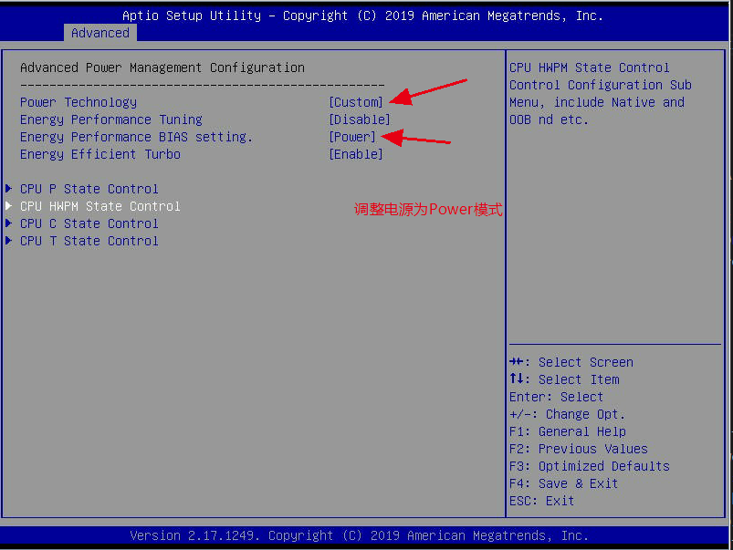
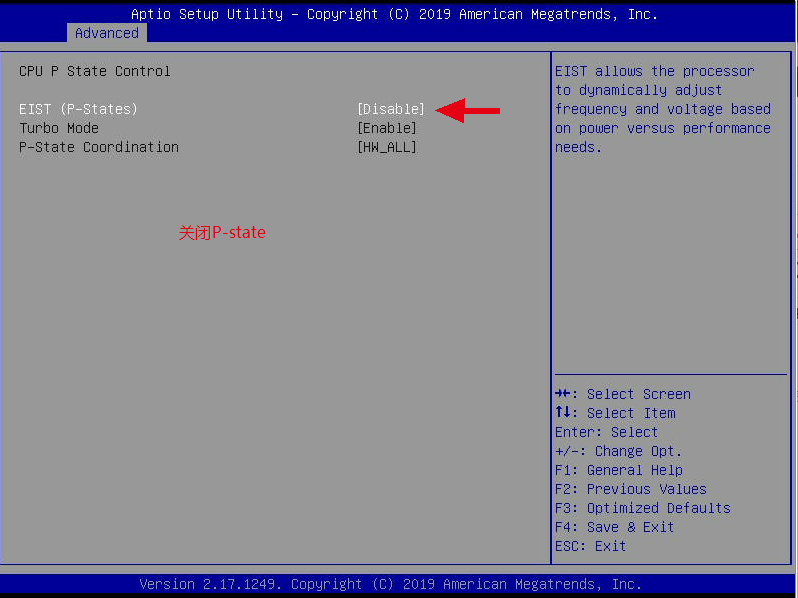
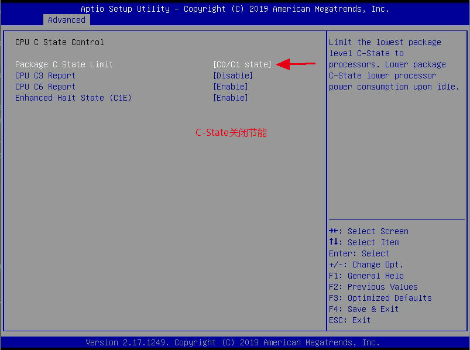
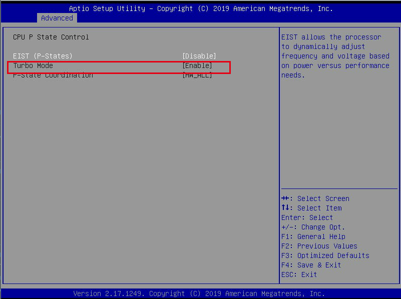
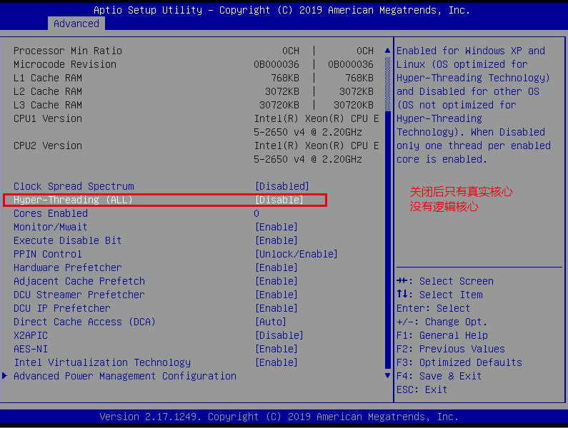

# Bios调优

## 了解BIOS配置并进行性能调整

[BIOS性能调优原文](https://community.mellanox.com/s/article/understanding-bios-configuration-for-performance-tuning)

[优化调整示例](https://community.mellanox.com/s/article/bios-performance-tuning-example)

1. Power - 能耗等级

Configure power to run at maximum power for maximum performance.
配置电源为最高性能模式
 
 

2. P-State - 不使用CPU时睡眠选项

if enabled, the CPU (all cores on specific NUMA) will go to "sleep" mode in case there is no activity. This mode is similar to C-State but for the whole NUMA node. In most cases, it saves power in idle times. However, for performance oriented systems, when power consumption is not an issue, it is recommended that P-State is disabled.

**节能模式调整，如果不考虑功耗，则禁用P状态**

 

3. C-State - 空闲时降低CPU功率

For energy saving, It is possible to lower the CPU power when it is idle. Each CPU has several power modes called “C-states” or “C-modes.” This operation is not suitable while BIOS performance configuration, therefore, it should be disabled. For more information about C-State, please refer to Everything You Need to Know About the CPU C-States.

**节能模式调整，如果不考虑功耗，则禁用C状态**

[C-State](./C-State.md)

4. Turbo Mode - Intel超频技术

(Intel) Turbo Boost Technology automatically runs the processor core faster than the noted frequency. The processor must be working in the power, temperature, and specification limits of the thermal design power (TDP). Both single and multi-threaded application performance is increased. For more info, see Intel® Turbo Boost Technology Frequently Asked Questions

**P-state禁用时无法修改**
 
 

5. Hyper Threading - 超线程

Allows a CPU to work on multiple streams of data simultaneously, improving performance and efficiency. In some cases, turning HyperThreading off results in higher performance with single-threaded tasks. For regular systems, in most cases, it should be turned on. In cases where the CPU is close to 100% utilization, hyper-threading might not help and even harm performance. Therefore, in such cases, Hyper Threading should be disabled.

**测试时禁用，但是客户的话一般希望核心多一些**
**关闭超线程单核性能强，开启超线程核心多**
 
 

6. IO Non Posted Prefetching - IO非发布预取（需要禁用，不是所有主BIOS有此选项）

This parameter is relevant to haswell/broadwell and onwards, and should be disabled on those systems. Note, it is not exposed on all BIOS versions.

7. CPU Frequency - CPU频率调整（AMD）

maximum speed for maximum performance.

 

8. Memory Speed -内存速度调整

maximum speed for maximum performance.

**下图选项还没有验证**

 

9. Memory channel mode -  内存通道调整（AMD）

Use the independent mode for performance. By using this mode, it is therefore possible that each memory channel has its own memory controller which operates the memory channel at full speed.

 

10. Node Interleaving - 节点交错（性能调优禁用）

 When node interleaving is disabled, NUMA mode is enabled. Conversely, enabling Node Interleaving means that memory is interleaved between memory nodes, and there is no NUMA presentation to the operating system. For performance reasons, we wish to disable interleaving (and enable NUMA), thus ensuring that memory is always allocated to the local NUMA node for any given logical processor.

 

11. Channel Interleaving - 通道交错

Channel interleaving splits the RAM into sections to enable multiple r/w at the same time.

 

12. Thermal Mode - 散热模式

Functions properly in Performance mode (which also may mean high power, higher fan speed, etc.).

 

13. HPC Optimizations - HPC优化（AMD）

This mode is similar to C-state mode as they are supported in AMD processors only.